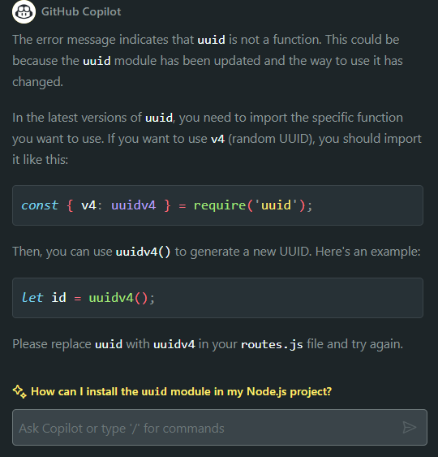
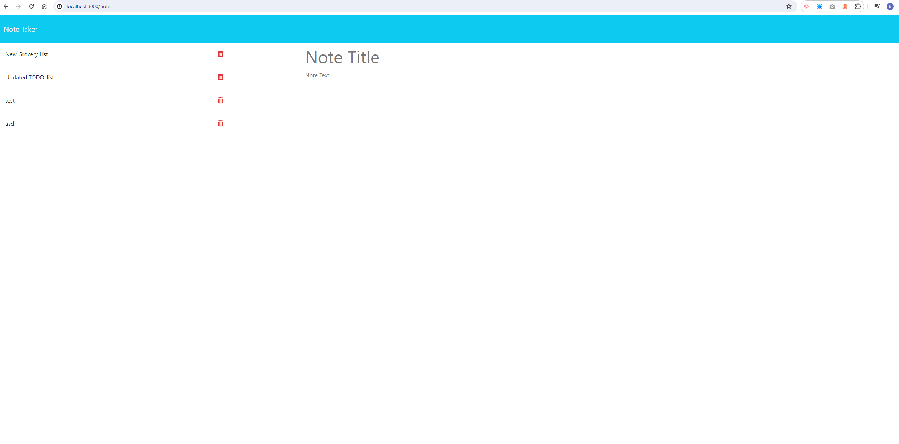

# Take-my-notes

## Acceptance Criteria

GIVEN a note-taking application
WHEN I open the Note Taker
THEN I am presented with a landing page with a link to a notes page
WHEN I click on the link to the notes page
THEN I am presented with a page with existing notes listed in the left-hand column, plus empty fields to enter a new note title and the note’s text in the right-hand column
WHEN I enter a new note title and the note’s text
THEN a "Save Note" button and a "Clear Form" button appear in the navigation at the top of the page
WHEN I click on the Save button
THEN the new note I have entered is saved and appears in the left-hand column with the other existing notes and the buttons in the navigation disappear
WHEN I click on an existing note in the list in the left-hand column
THEN that note appears in the right-hand column and a "New Note" button appears in the navigation
WHEN I click on the "New Note" button in the navigation at the top of the page
THEN I am presented with empty fields to enter a new note title and the note’s text in the right-hand column and the button disappears

## About

Take-my-notes is an application designed to write, save, and delete notes. This application uses an express backend and save and retrieve note data from a JSON file.

## Installation

1. Clone the repository to your local machine using `git clone <repository-url>`.
2. Navigate to the cloned repository in your terminal.
3. Install the necessary dependencies by running `npm install`.
4. Start the server by running `npm start`.
5. Open your web browser and navigate to `http://localhost:3000` to start using the Note-Taker application.

## Usage

Take-my-notes application presents users with a landing page with a link to a notes page. When the link is clicked, users are presented with a page with existing notes listed in the left-hand column, plus empty fields to enter a new note title and the note’s text in the right-hand column. 

Users can write new notes and save them, which will cause them to appear in the left-hand column with the other existing notes. Users can also click on existing notes to view them.

## Challenges

The main challenges faced during the development of this application were setting up the express server and handling the get and post requests for the notes.
Another challenge I faced was with the `uuid` module. Initially, I was getting an error saying `uuid is not a function`. After some debugging, I realized that the way to import and use the `uuid` module had changed in its latest version. Instead of using `const uuid = require('uuid')` and then `uuid()`, I had to use `const { v4: uuidv4 } = require('uuid')` and then `uuidv4()` to generate a new UUID. This was a good learning experience about the importance of keeping up with updates to the modules I use.

## Launched Site

